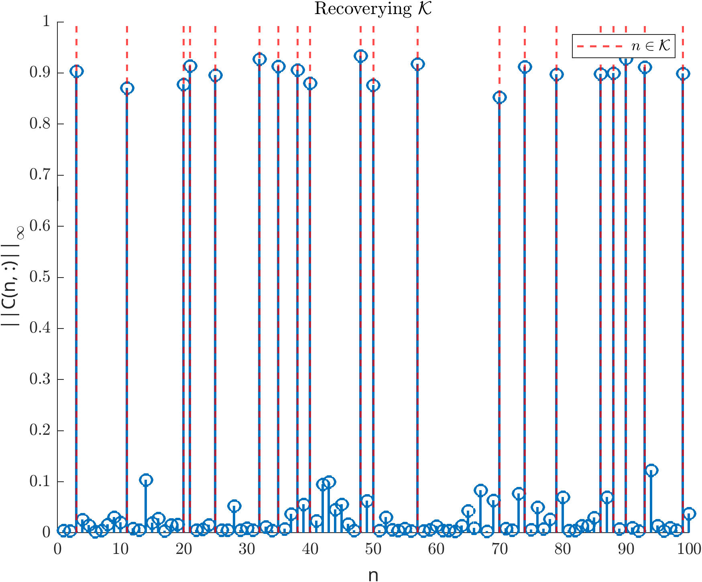
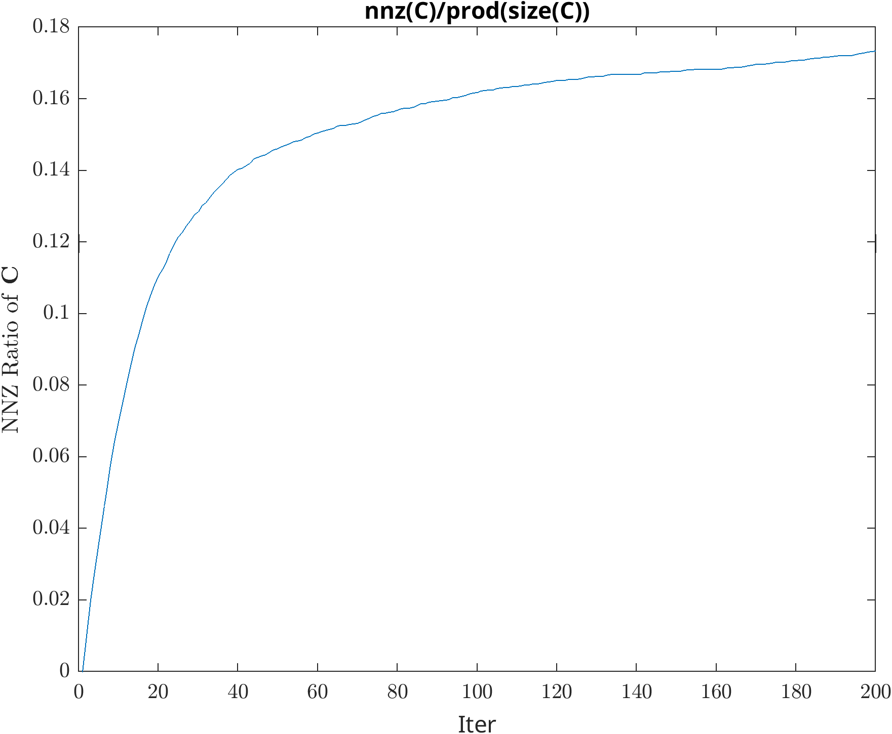

Implemetation of paper
__"Nguyen, T., Fu, X. and Wu, R., 2021. Memory-efficient convex optimization for self-dictionary separable nonnegative matrix factorization: A frank-wolfe approach. arXiv preprint arXiv:2109.11135. (Submitted to TSP, accepted, 2022.)"__

`MERIT__test` shows how to use MERIT function with 2 options of using Matlab or Mex version.

`MERIT__recover_K` shows a simple simulation that how MERIT extracts set K with memory efficiency, as demonstrated in the following 2 figures

For a reference of producing results in the paper, please run (or take a look at `readme.md`) in 

    - For synthetic setting in Fig 2, 3: `exp_synthetic/setting1.m `
    - For synthetic setting in Fig 4a: `exp_synthetic/setting2.m`
    - For memory comparison in Fig 4b: `exp_synthetic/mem/`
    - For real data experiments, `exp_real/community_detection/`  and `exp_real/topic_modeling/`

